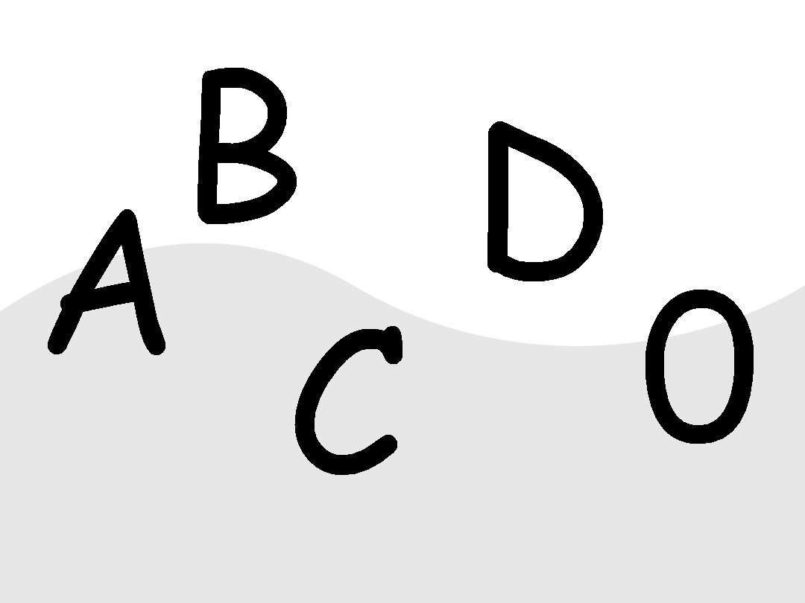

# Crypto04

**Author:** Pr0pylTh10ur4C1L

**Difficulty:** Easy

**Category:** Cryptography

## Title description
Một vài CTV trong CLB EHC đã thuê một căn homestay tọa lạc tại số nhà 1-42, ngõ 525 đường Hola để cùng nhau học tập chuẩn bị cho cuộc thi EHCTF-2024 sắp tới. Họ đã thuê được căn homestay này với giá siêu ưu đãi, 0 đồng! Tuy nhiên, trong căn homestay này ẩn chứa một bí mật. Dựa trên những con số mà họ tìm thấy xung quanh căn homestay này, cùng với bức ảnh dưới đây, họ đã tạo nên được một phương trình. Sau khi giải phương trình này, họ đã thu được ba con số mà khi tổng hợp ba con số này, họ thu được giá trị đại diện cho câu trả lời cho câu hỏi cuối cùng về sự sống, vũ trụ và vạn vật. Liệu bạn có đoán được ba con số mà họ đã tìm ra, cũng như giá trị trên không?

Câu trả lời sẽ có dạng: **EHCTF{i_j_k_l}**, với i, j, k là 3 số bạn tìm ra theo thứ tự tăng dần và l là giá trị đại diện trên.

